# 写在最前：
涂鸦外部开发者有flutter集成诉求，这里以登陆、注册为例，记录一个最简单的基于 SDK业务包 的flutter demo，实现flutter 和 SDK的互相调用的Demo。因为只是为了演示如何通过Flutter调用涂鸦SDK能力，所以这里仅演示部分功能：

在接入项目之前，先了解一下flutter开发的4种方式：
1. App：全部为flutter实现的开发方式，适用于全新开发的app
2. Module： 将flutter项目以组件的形式接入到已有的原生工程中，可以依赖Package 和 Plugin
3. Package：不包含原生代码的flutter基础组件包
4. Plugin： 相比于package多了原生代码的组件包

根据本次需求，我们使用 Flutter plugin 实现基于涂鸦SDK的插件，包含 Flutter 和 原生SDK 接口相互调用的能力。

flutter plugin 允许 flutter代码 和 原生代码 相互调用，这里我们使用登陆SDK 邮箱账号 相关接口为例：
1. 发送验证码
2. 使用邮箱地址注册账号
3. 使用邮箱地址和密码登录账号


## SDK 环境准备：

这一步已完成的同学可以跳过，[涂鸦SDK集成](https://developer.tuya.com/cn/docs/app-development/integrate-sdk?id=Ka5d52ewngdoi)

登陆涂鸦开发者平台，找到自己的SDK开发App，下载SDK并构建完成后，可以下载两端的依赖文件，下载下来备用：

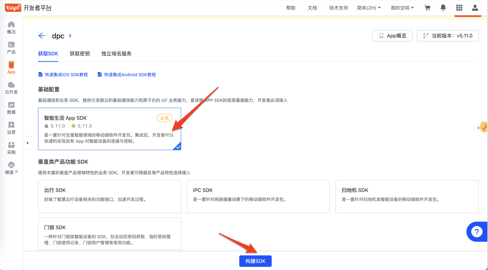

## 创建插件

[创建Flutter插件](./doc/flutter.md)

## Dart代码开发：

#### 接口定义

遵循官方推荐规范，插件接口定义在 thing_flutter_login_plugin_platform_interface.dart 内：

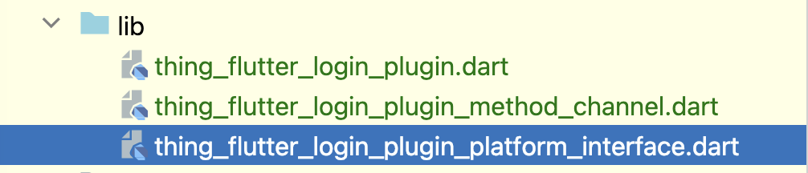

主要包含接口定义：

```
import 'package:plugin_platform_interface/plugin_platform_interface.dart';

import 'thing_flutter_login_plugin_method_channel.dart';

abstract class ThingFlutterLoginPluginPlatform extends PlatformInterface {
  /// Constructs a ThingFlutterLoginPluginPlatform.
  ThingFlutterLoginPluginPlatform() : super(token: _token);

  static final Object _token = Object();

  static ThingFlutterLoginPluginPlatform _instance =
      MethodChannelThingFlutterLoginPlugin();

  /// The default instance of [ThingFlutterLoginPluginPlatform] to use.
  ///
  /// Defaults to [MethodChannelThingFlutterLoginPlugin].
  static ThingFlutterLoginPluginPlatform get instance => _instance;

  /// Platform-specific implementations should set this with their own
  /// platform-specific class that extends [ThingFlutterLoginPluginPlatform] when
  /// they register themselves.
  static set instance(ThingFlutterLoginPluginPlatform instance) {
    PlatformInterface.verifyToken(instance, _token);
    _instance = instance;
  }

  //发送验证码
  Future<void> sendVerifyCode({
    required String userName, //用户的邮箱地址或手机号码
    String? region,
    //地区，可以通过 [ThingSmartUser regionListWithCountryCode:success:failure:] 或者 [ThingSmartUser getDefaultRegionWithCountryCode:] 查询
    required String countryCode, //国家或地区码，例如 86 代表中国大陆地区
    required int type,
    //验证码类型。取值：1：使用邮箱地址注册账号时，发送验证码 2：使用邮箱地址登录账号时，发送验证码 3：重置邮箱地址注册的账号的密码时，发送验证码
    void Function()? success, //接口发送成功回调
    void Function(String error)? failure, //接口发送失败回调，error 表示失败原因
  }) async {
    throw UnimplementedError('sendVerifyCode() has not been implemented.');
  }

  //使用邮箱地址注册账号
  Future<void> registerByEmail({
    required String countryCode, //国家码，例如 86
    required String email, //邮箱地址
    required String password, //密码
    required String code, //经过验证码发送接口，收到的验证码
    void Function()? success, //接口发送成功回调
    void Function(String error)? failure, //接口发送失败回调，error 表示失败原因
  }) async {
    throw UnimplementedError('registerByEmail() has not been implemented.');
  }

  //使用邮箱地址和密码登录账号
  Future<void> loginByEmail({
    required String countryCode, //国家码，例如 86
    required String email, //邮箱地址
    required String password, //密码
    void Function(Map<String, dynamic> userInfo)? success, //接口发送成功回调
    void Function(String error)? failure, //接口发送失败回调，error 表示失败原因
  }) async {
    throw UnimplementedError('loginByEmail() has not been implemented.');
  }
}
```
*ps：SDK 里定义了多个接口，本次demo只用到其中部分接口*

#### 接口实现 

在 thing_flutter_login_plugin_method_channel.dart 内（这里截图部分代码）：

```
import 'package:flutter/foundation.dart';
import 'package:flutter/services.dart';
import 'thing_flutter_login_plugin_platform_interface.dart';

/// An implementation of [ThingFlutterLoginPluginPlatform] that uses method channels.
class MethodChannelThingFlutterLoginPlugin
    extends ThingFlutterLoginPluginPlatform {
  /// The method channel used to interact with the native platform.
  @visibleForTesting
  final methodChannel = const MethodChannel('thing_flutter_login_plugin');

  MethodChannelThingFlutterLoginPlugin() {
    methodChannel.setMethodCallHandler((MethodCall call) async {
      if (kDebugMode) {
        print('接收到原生的函数调用:${call.method}');
      }

      // 其他业务代码处理
      return await Future.delayed(const Duration(seconds: 1), () {
        return {'resule': 0, 'msg': 'notImplemented'};
      });
    });
  }

  @override
  Future<void> sendVerifyCode({
    required String userName, //用户的邮箱地址或手机号码
    String? region,
    //地区，可以通过 [ThingSmartUser regionListWithCountryCode:success:failure:] 或者 [ThingSmartUser getDefaultRegionWithCountryCode:] 查询
    required String countryCode, //国家或地区码，例如 86 代表中国大陆地区
    required int type,
    //验证码类型。取值：1：使用邮箱地址注册账号时，发送验证码 2：使用邮箱地址登录账号时，发送验证码 3：重置邮箱地址注册的账号的密码时，发送验证码
    void Function()? success, //接口发送成功回调
    void Function(String error)? failure, //接口发送失败回调，error 表示失败原因
  }) async {
    final resultMap = await methodChannel.invokeMethod('sendVerifyCode', {
      'userName': userName,
      'region': region,
      'countryCode': countryCode,
      'type': type
    });

    final isSucc = resultMap['success'];

    if (isSucc) {
      if (success != null) {
        success();
      }
    } else {
      if (failure != null) {
        final errorMsg = resultMap['errorMsg'];
        failure(errorMsg);
      }
    }
  }

  @override
  Future<void> registerByEmail({
    required String countryCode, //国家码，例如 86
    required String email, //邮箱地址
    required String password, //密码
    required String code, //经过验证码发送接口，收到的验证码
    void Function()? success, //接口发送成功回调
    void Function(String error)? failure, //接口发送失败回调，error 表示失败原因
  }) async {
    final resultMap = await methodChannel.invokeMethod('registerByEmail', {
      'email': email,
      'password': password,
      'countryCode': countryCode,
      'code': code
    });

    final isSucc = resultMap['success'];

    if (isSucc) {
      if (success != null) {
        success();
      }
    } else {
      if (failure != null) {
        final errorMsg = resultMap['errorMsg'];
        failure(errorMsg);
      }
    }
  }

  @override
  Future<void> loginByEmail({
    required String countryCode, //国家码，例如 86
    required String email, //邮箱地址
    required String password, //密码
    void Function(Map<String, dynamic> userInfo)? success, //接口发送成功回调
    void Function(String error)? failure, //接口发送失败回调，error 表示失败原因
  }) async {
    final resultMap = await methodChannel.invokeMethod('loginByEmail',
        {'email': email, 'password': password, 'countryCode': countryCode});

    final succ = resultMap['success'];

    if (succ) {
      Map<String, dynamic> result = {};

      resultMap['result'].forEach((key, value) {
        if (key is String) {
          result[key] = value;
        }
      });

      if (success != null) {
        success(result);
      }
    } else {
      if (failure != null) {
        final errorMsg = resultMap['errorMsg'];
        failure(errorMsg);
      }
    }
  }
}
```

#### 开放接口：

见代码 thing_flutter_login_plugin.dart

```
import 'thing_flutter_login_plugin_platform_interface.dart';

class ThingFlutterLoginPlugin {
  Future<void> sendVerifyCode({
    required String userName, //用户的邮箱地址或手机号码
    String? region,
    //地区，可以通过 [ThingSmartUser regionListWithCountryCode:success:failure:] 或者 [ThingSmartUser getDefaultRegionWithCountryCode:] 查询
    required String countryCode, //国家或地区码，例如 86 代表中国大陆地区
    required int type,
    //验证码类型。取值：1：使用邮箱地址注册账号时，发送验证码 2：使用邮箱地址登录账号时，发送验证码 3：重置邮箱地址注册的账号的密码时，发送验证码
    void Function()? success, //接口发送成功回调
    void Function(String error)? failure, //接口发送失败回调，error 表示失败原因
  }) async {
    await ThingFlutterLoginPluginPlatform.instance.sendVerifyCode(
        userName: userName,
        region: region,
        countryCode: countryCode,
        type: type,
        success: success,
        failure: failure);
  }

  Future<void> registerByEmail({
    required String countryCode, //国家码，例如 86
    required String email, //邮箱地址
    required String password, //密码
    required String code, //经过验证码发送接口，收到的验证码
    void Function()? success, //接口发送成功回调
    void Function(String error)? failure, //接口发送失败回调，error 表示失败原因
  }) async {
    await ThingFlutterLoginPluginPlatform.instance.registerByEmail(
        countryCode: countryCode,
        email: email,
        password: password,
        code: code,
        success: success,
        failure: failure);
  }

  Future<void> loginByEmail({
    required String countryCode, //国家码，例如 86
    required String email, //邮箱地址
    required String password, //密码
    void Function(Map<String, dynamic> userInfo)? success, //接口发送成功回调
    void Function(String error)? failure, //接口发送失败回调，error 表示失败原因
  }) async {
    await ThingFlutterLoginPluginPlatform.instance.loginByEmail(
        countryCode: countryCode,
        email: email,
        password: password,
        success: success,
        failure: failure);
  }
}
```

## iOS 插件实现：

#### 插件 podspce 添加依赖

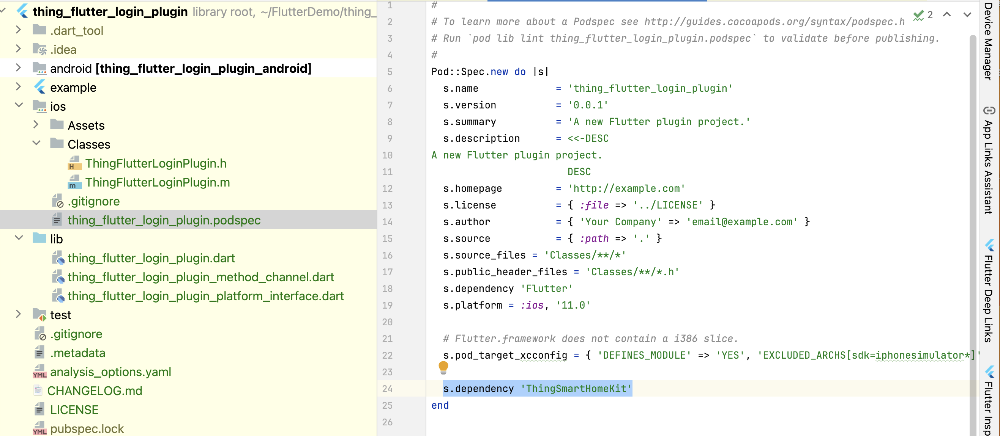

#### 设置App主工程

- 根据涂鸦SDK开发文档要求设置podfile，例如下面先用插件自带的demo验证插件接口时，设置依赖的安全库和SDK组件库并安装：

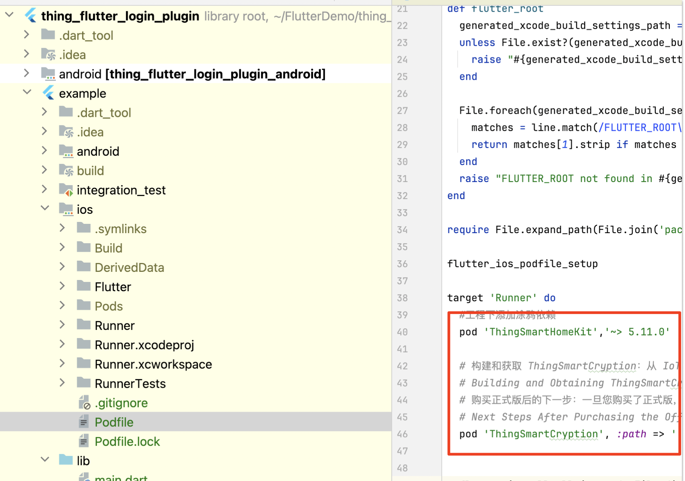

- 代码修改，设置Appkey、secretkey、更新app bundle id：

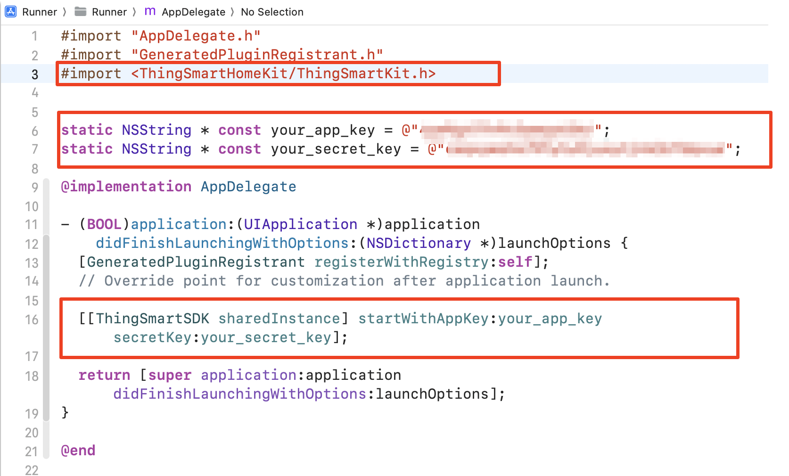

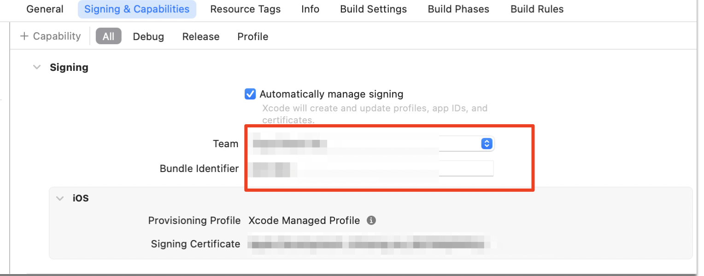

- 添加安全库

把上文下载的SDK文件解压，demo这里为了简单，放在同一个目录：

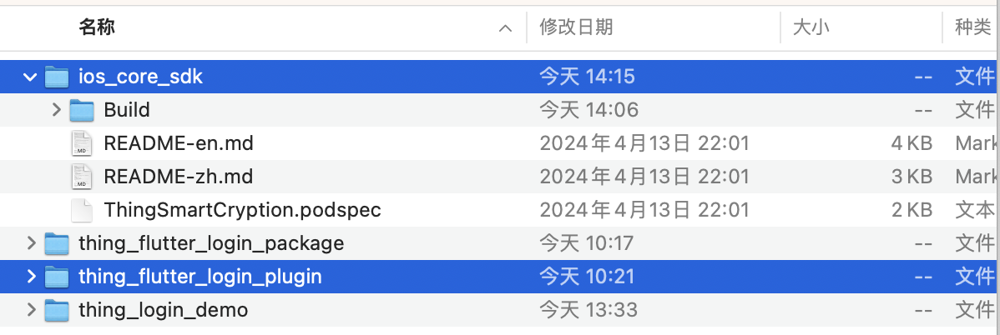

#### 接口实现

我们使用 XCode 打开 插件的 demo 工程时，可以看到插件里有两个文件：

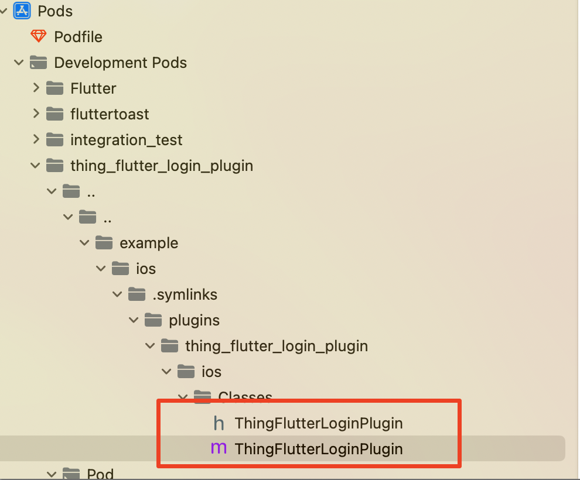

完成插件接口调用，例如：

```
#import "ThingFlutterLoginPlugin.h"
#import <ThingSmartBaseKit/ThingSmartBaseKit.h>

static FlutterMethodChannel * sLoginPluginChannel;

@implementation ThingFlutterLoginPlugin
+ (void)registerWithRegistrar:(NSObject<FlutterPluginRegistrar>*)registrar {
    sLoginPluginChannel = [FlutterMethodChannel
                           methodChannelWithName:@"thing_flutter_login_plugin"
                           binaryMessenger:[registrar messenger]];
    ThingFlutterLoginPlugin* instance = [[ThingFlutterLoginPlugin alloc] init];
    [registrar addMethodCallDelegate:instance channel:sLoginPluginChannel];
}

- (void)handleMethodCall:(FlutterMethodCall*)call result:(FlutterResult)result {
#ifdef DEBUG
    NSLog(@"=====>iOS Native receive FlutterMethodCall method:%@  arguments:%@", call.method, call.arguments);
#endif
    
    NSDictionary * dic = call.arguments;
    if (![dic isKindOfClass:NSDictionary.class]) {
        result(@{@"success":@(NO),
                 @"errorMsg": @"Illegal parameter"});
        return;
    }
    if ([@"sendVerifyCode" isEqualToString:call.method]) {
        [self sendVerifyCode:dic result:result];
    } else if ([@"registerByEmail" isEqualToString:call.method]) {
        [self registerByEmail:dic result:result];
    } else if ([@"loginByEmail" isEqualToString:call.method]) {
        [self loginByEmail:dic result:result];
    }
    else {
        result(FlutterMethodNotImplemented);
    }
}

- (void)sendVerifyCode:(NSDictionary *)arguments result:(FlutterResult)result {
    NSString * usetName = [arguments objectForKey:@"userName"];
    NSString * region = [arguments objectForKey:@"region"];
    NSString * countryCode = [arguments objectForKey:@"countryCode"];
    NSUInteger type = [[arguments objectForKey:@"type"] integerValue];
    
    if (usetName.length == 0 ||
        countryCode.length == 0
        ) {
        result(@{@"success":@(NO),
                 @"errorMsg": @"Illegal parameter"});
        return;
    }
    
    [[ThingSmartUser sharedInstance] sendVerifyCodeWithUserName:usetName
                                                         region:region countryCode:countryCode type:type
                                                        success:^{
        result(@{@"success":@(YES)});
    } failure:^(NSError *error) {
        result(@{@"success":@(NO),
                 @"errorMsg": error.localizedDescription});
    }];
    
#ifdef DEBUG
    dispatch_after(dispatch_time(DISPATCH_TIME_NOW, (int64_t)(3 * NSEC_PER_SEC)), dispatch_get_main_queue(), ^{
        [self.class testCallFlutterFunc];
    });
#endif
}

- (void)registerByEmail:(NSDictionary *)arguments result:(FlutterResult)result {
    NSString * email = [arguments objectForKey:@"email"];
    NSString * password = [arguments objectForKey:@"password"];
    NSString * countryCode = [arguments objectForKey:@"countryCode"];
    NSString * code = [arguments objectForKey:@"code"];
    
    if (email.length == 0 ||
        password.length == 0 ||
        countryCode.length == 0
        ) {
        result(@{@"success":@(NO),
                 @"errorMsg": @"Illegal parameter"});
        return;
    }
    
    [[ThingSmartUser sharedInstance] registerByEmail:countryCode email:email password:password code:code success:^{
        result(@{@"success":@(YES)});
    } failure:^(NSError *error) {
        result(@{@"success":@(NO),
                 @"errorMsg": error.localizedDescription});
    }];
}

- (void)loginByEmail:(NSDictionary *)arguments result:(FlutterResult)result {
    NSString * email = [arguments objectForKey:@"email"];
    NSString * password = [arguments objectForKey:@"password"];
    NSString * countryCode = [arguments objectForKey:@"countryCode"];
    
    if (email.length == 0 ||
        password.length == 0 ||
        countryCode.length == 0
        ) {
        result(@{@"success":@(NO),
                 @"errorMsg": @"Illegal parameter"});
        return;
    }
    
    [[ThingSmartUser sharedInstance] loginByEmail:countryCode email:email password:password success:^{
        
        NSDictionary * userInfo = @{
            @"sid" : [ThingSmartUser sharedInstance].sid ? : @"",
            @"uid" : [ThingSmartUser sharedInstance].uid ? : @"",
            @"headIconUrl" : [ThingSmartUser sharedInstance].headIconUrl ? : @"",
            @"nickname" : [ThingSmartUser sharedInstance].nickname ? : @"",
            @"userName" : [ThingSmartUser sharedInstance].userName ? : @"",
            @"phoneNumber" : [ThingSmartUser sharedInstance].phoneNumber ? : @"",
            @"email" : [ThingSmartUser sharedInstance].email ? : @"",
            @"countryCode" : [ThingSmartUser sharedInstance].countryCode ? : @"",
            @"isLogin" : @([ThingSmartUser sharedInstance].isLogin ? 1 : 0),
            @"regionCode" : [ThingSmartUser sharedInstance].regionCode ? : @"",
            @"domain" : [ThingSmartUser sharedInstance].domain ? : @"",
            @"timezoneId" : [ThingSmartUser sharedInstance].timezoneId ? : @"",
            @"partnerIdentity" : [ThingSmartUser sharedInstance].partnerIdentity ? : @"",
            @"mbHost" : [ThingSmartUser sharedInstance].mbHost ? : @"",
            @"gwHost" : [ThingSmartUser sharedInstance].gwHost ? : @"",
            @"port" : @([ThingSmartUser sharedInstance].port),
            @"useSSL" : @([ThingSmartUser sharedInstance].useSSL ? 1 : 0),
            @"quicHost" : [ThingSmartUser sharedInstance].quicHost ? : @"",
            @"quicPort" : @([ThingSmartUser sharedInstance].quicPort),
            @"useQUIC" : @([ThingSmartUser sharedInstance].useQUIC ? 1 : 0),
            @"tempUnit" : @([ThingSmartUser sharedInstance].tempUnit),
            @"regFrom" : @([ThingSmartUser sharedInstance].regFrom),
            @"snsNickname" : [ThingSmartUser sharedInstance].snsNickname ? : @"",
            @"ecode" : [ThingSmartUser sharedInstance].ecode ? : @"",
            @"userType" : @([ThingSmartUser sharedInstance].userType),
            @"extras" : [ThingSmartUser sharedInstance].extras ? : @{},
            @"userAlias" : [ThingSmartUser sharedInstance].userAlias ? : @"",
        };

        result(@{@"success":@(YES),
                 @"result" : userInfo
               });
    } failure:^(NSError *error) {
        result(@{@"success":@(NO),
                 @"errorMsg": error.localizedDescription});
    }];
}

+ (void)testCallFlutterFunc {
    NSLog(@"=====>iOS Native call Flutter func");
    
    [sLoginPluginChannel invokeMethod:@"flutterFuncName" arguments:@{@"key" : @"value"} result:^(id  _Nullable result) {
        NSLog(@"=====>iOS Native call Flutter func result:%@", result);
    }];
}
@end

```
*ps：代码仅作参考*


## Andrtoi 插件开发

#### 配置 build.gradle 文件

在项目的 build.gradle 文件里添加dependencies 依赖库

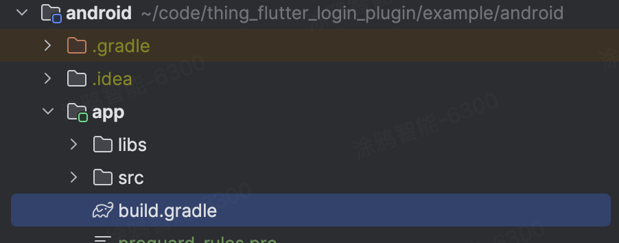

```
android {
   defaultConfig {
      ndk {
         abiFilters "armeabi-v7a", "arm64-v8a"
      }
   }
   packagingOptions {
      pickFirst 'lib/*/libc++_shared.so' // 多个 AAR（Android Library）文件中存在此 .so 文件，请选择第一个
   }
}

configurations.all {
    exclude group: "com.thingclips.smart" ,module: 'thingsmart-modularCampAnno'
}

dependencies {
   implementation fileTree(dir: 'libs', include: ['*.aar'])
   implementation 'com.alibaba:fastjson:1.1.67.android'
   implementation 'com.squareup.okhttp3:okhttp-urlconnection:3.14.9'

   // App SDK 最新稳定安卓版：
   implementation 'com.facebook.soloader:soloader:0.10.4+'
   implementation 'com.thingclips.smart:thingsmart:5.11.3'
}
```

并在根目录的 build.gradle 文件中进行仓库配置

```
repositories {
   jcenter()
   maven { url 'https://maven-other.tuya.com/repository/maven-releases/' }
   maven { url "https://maven-other.tuya.com/repository/maven-commercial-releases/" }
   maven { url 'https://jitpack.io' }
   google()
   mavenCentral()
   maven { url 'https://maven.aliyun.com/repository/public' }
   maven { url 'https://central.maven.org/maven2/' }
   maven { url 'https://oss.sonatype.org/content/repositories/snapshots/' }
   maven { url 'https://developer.huawei.com/repo/' }
}
```

#### 集成安全组件

将上文下载后的android资料包解压，并将 security-algorithm.aar 放置到工程 libs 目录下，并在工程 build.gradle 的 dependencies 中添加以下依赖：

```
implementation fileTree(include: ['*.aar'], dir: 'libs')

```

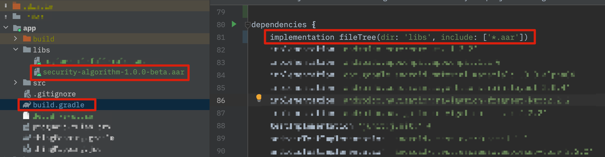

#### 设置 Appkey、AppSecret 和证书签名

配置应用证书并且将 SHA256 密钥填入的 证书 中; 获取AppKey，以及AppSecret，并配置在 AndroidManifest.xml中：

```
<meta-dataandroid:name="THING_SMART_APPKEY"
android:value="应用 Appkey" />
<meta-dataandroid:name="THING_SMART_SECRET"
android:value="应用密钥 AppSecret" />
```

#### 接口实现

Application 的主线程中初始化 SDK，新建BaseApplication

```
class BaseApplication : Application() {
    override fun onCreate() {
        super.onCreate()
        ThingHomeSdk.init(this)
    }
}
```

并在AndroidManifest.xml中加入

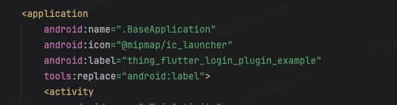

在ThingFlutterLoginPlugin.kt完成插件接口调用

```
package com.tuya.thing_flutter_login_plugin

import androidx.annotation.NonNull
import com.thingclips.smart.android.user.api.ILoginCallback
import com.thingclips.smart.android.user.api.IRegisterCallback
import com.thingclips.smart.android.user.bean.User
import com.thingclips.smart.home.sdk.ThingHomeSdk
import com.thingclips.smart.sdk.api.IResultCallback

import io.flutter.embedding.engine.plugins.FlutterPlugin
import io.flutter.plugin.common.MethodCall
import io.flutter.plugin.common.MethodChannel
import io.flutter.plugin.common.MethodChannel.MethodCallHandler
import io.flutter.plugin.common.MethodChannel.Result

/** ThingFlutterLoginPlugin */
private const val TAG = "ThingFlutterLoginPlugin"
class ThingFlutterLoginPlugin : FlutterPlugin, MethodCallHandler {
    /// The MethodChannel that will the communication between Flutter and native Android
    ///
    /// This local reference serves to register the plugin with the Flutter Engine and unregister it
    /// when the Flutter Engine is detached from the Activity
    private lateinit var channel: MethodChannel

    override fun onAttachedToEngine(flutterPluginBinding: FlutterPlugin.FlutterPluginBinding) {
        channel = MethodChannel(flutterPluginBinding.binaryMessenger, "thing_flutter_login_plugin")
        channel.setMethodCallHandler(this)
    }

    override fun onMethodCall(call: MethodCall, result: Result) {
        when (call.method) {
            "sendVerifyCode" -> sendVerifyCode(call.arguments as Map<String, Any>, result)
            "registerByEmail" -> registerByEmail(call.arguments as Map<String, Any>, result)
            "loginByEmail" -> loginByEmail(call.arguments as Map<String, Any>, result)
            else -> result.notImplemented()
        }
    }

    override fun onDetachedFromEngine(binding: FlutterPlugin.FlutterPluginBinding) {
        channel.setMethodCallHandler(null)
    }

    private fun sendVerifyCode(arguments: Map<String, Any>, result: Result) {
        val userName = arguments["userName"] as String
        val region = arguments["region"] as? String
        val countryCode = arguments["countryCode"] as String
        val type = arguments["type"] as Int
        android.util.Log.d(TAG, "sendVerifyCode: $userName $region $countryCode $type")
        if (userName.isEmpty() || countryCode.isEmpty()) {
            result.error("Illegal parameter", null, null)
            return
        }

        val callback = object : IResultCallback {
            override fun onError(code: String, error: String) {
                result.error("error", error, null)
                android.util.Log.i(TAG, "IResultCallback: code $code error $error")
            }

            override fun onSuccess() {
                result.success(mapOf("success" to true))
                android.util.Log.d(TAG, "IRegisterCallback onSuccess: ")
            }
        }

        ThingHomeSdk.getUserInstance()
            .sendVerifyCodeWithUserName(userName, region, countryCode, type, callback)

    }

    private fun registerByEmail(arguments: Map<String, Any>, result: Result) {
        val email = arguments["email"] as String
        val password = arguments["password"] as String
        val countryCode = arguments["countryCode"] as String
        val code = arguments["code"] as String

        android.util.Log.d(TAG, "registerByEmail: $email $password $countryCode $code")
        if (email.isEmpty() || password.isEmpty() || countryCode.isEmpty()) {
            result.error("Illegal parameter", null, null)
            return
        }

        val callback = object : IRegisterCallback {
            override fun onSuccess(user: User?) {
                result.success(mapOf("success" to true))
                android.util.Log.d(TAG, "IRegisterCallback onSuccess: ")
            }

            override fun onError(code: String, error: String) {
                result.error("Error", error, null)
                android.util.Log.i(TAG, "IRegisterCallback: code $code error $error")
            }
        }
        ThingHomeSdk.getUserInstance()
            .registerAccountWithEmail(countryCode, email, password, code, callback);

    }

    private fun loginByEmail(arguments: Map<String, Any>, result: Result) {

        val email = arguments["email"] as String
        val password = arguments["password"] as String
        val countryCode = arguments["countryCode"] as String

        if (email.isEmpty() || password.isEmpty() || countryCode.isEmpty()) {
            result.error("Illegal parameter", null, null)
            return
        }
        val callback = object : ILoginCallback {
            override fun onSuccess(user: User?) {
                val userInfo = mapOf(
                    "sid" to (ThingHomeSdk.getUserInstance().user?.sid ?:""),
                    "uid" to (ThingHomeSdk.getUserInstance().user?.uid ?:""),
                    "headIconUrl" to (ThingHomeSdk.getUserInstance().user?.headPic ?:""),
                    "nickname" to (ThingHomeSdk.getUserInstance().user?.nickName ?: ""),
                    "userName" to (ThingHomeSdk.getUserInstance().user?.username ?: ""),
                    "phoneNumber" to (ThingHomeSdk.getUserInstance().user?.phoneCode ?: ""),
                    "email" to (ThingHomeSdk.getUserInstance().user?.email ?: ""),
                    "partnerIdentity" to (ThingHomeSdk.getUserInstance().user?.partnerIdentity ?: ""),
                    "tempUnit" to (ThingHomeSdk.getUserInstance().user?.tempUnit ?: 0),
                    "regFrom" to (ThingHomeSdk.getUserInstance().user?.regFrom ?: 0),
                    "snsNickname" to (ThingHomeSdk.getUserInstance().user?.snsNickname ?: ""),
                    "ecode" to (ThingHomeSdk.getUserInstance().user?.ecode ?: ""),
                    "userType" to (ThingHomeSdk.getUserInstance().user?.userType ?: 0),
                    "extras" to (ThingHomeSdk.getUserInstance().user?.extras ?: emptyMap<String, Any>()),
                    "userAlias" to (ThingHomeSdk.getUserInstance().user?.userAlias ?: "")
                )
                result.success(mapOf("success" to true, "result" to userInfo))
                android.util.Log.d(TAG, "ILoginCallback onSuccess: ")
            }

            override fun onError(code: String, error: String) {
                result.error("Error", error, null)
                android.util.Log.i(TAG, "ILoginCallback: code $code error $error")
            }
        }

        ThingHomeSdk.getUserInstance().loginWithEmail(countryCode, email, password, callback);
    }
}
```

# 运行验证：

下载本工程后，即可启动运行（*注意下载后，启动运行前，需要在工程按上方步骤完成涂鸦SDK配置，否则会启动崩溃*）
我们提供的插件里有一个 自测 demo，运行起来可以看到：

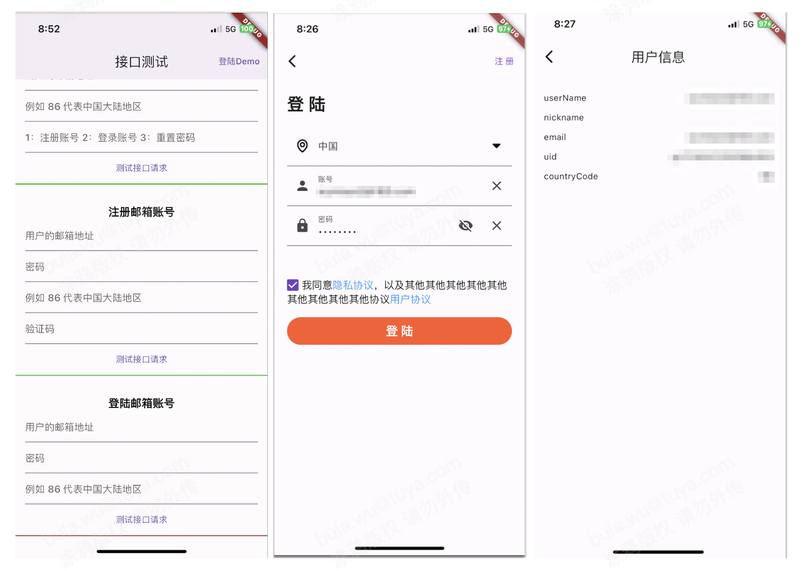

其他：ios的 插件里有一个彩蛋，debug 模式下发送验证码时，会在3秒后触发 原生 调用 dart 接口的场景：

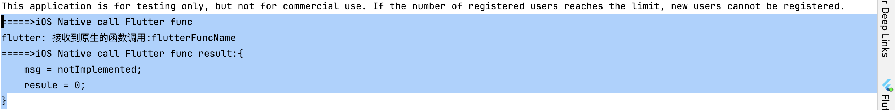
