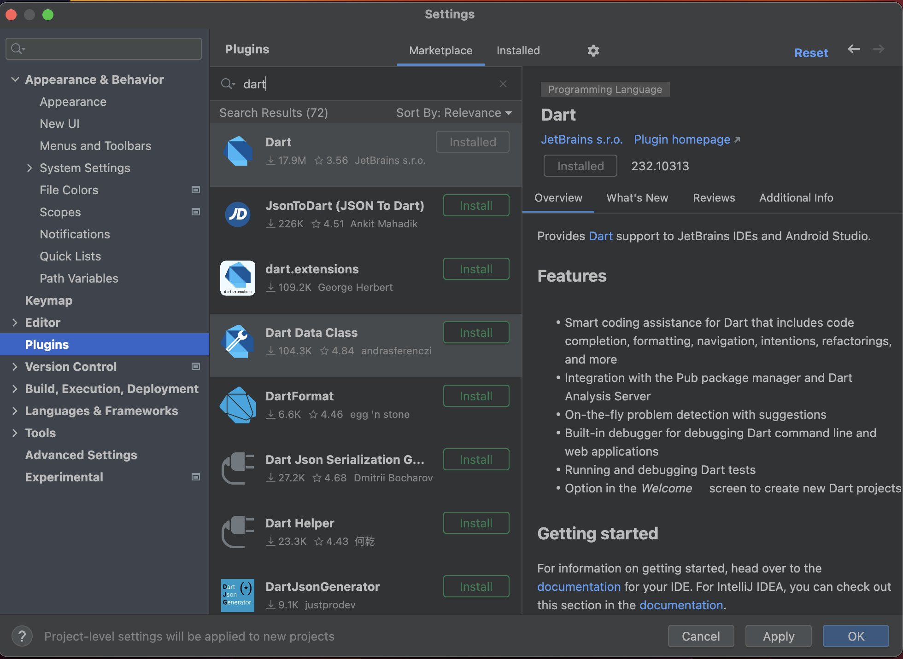
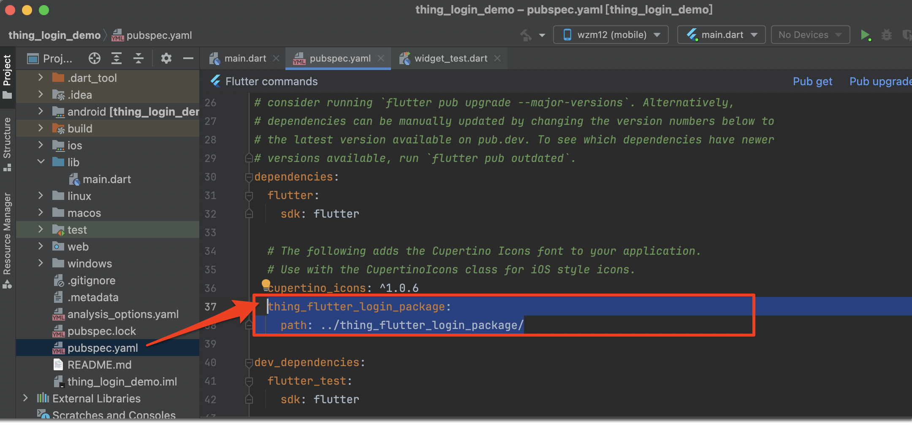
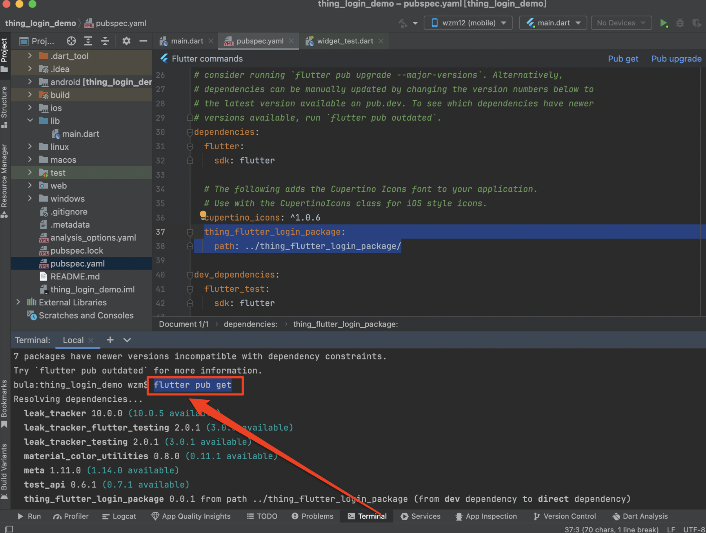
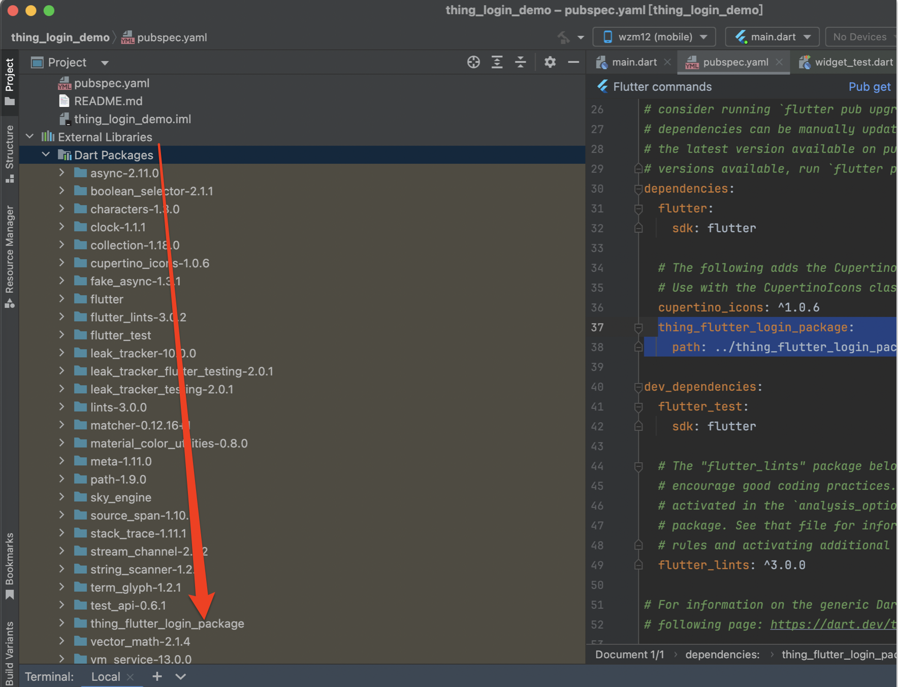
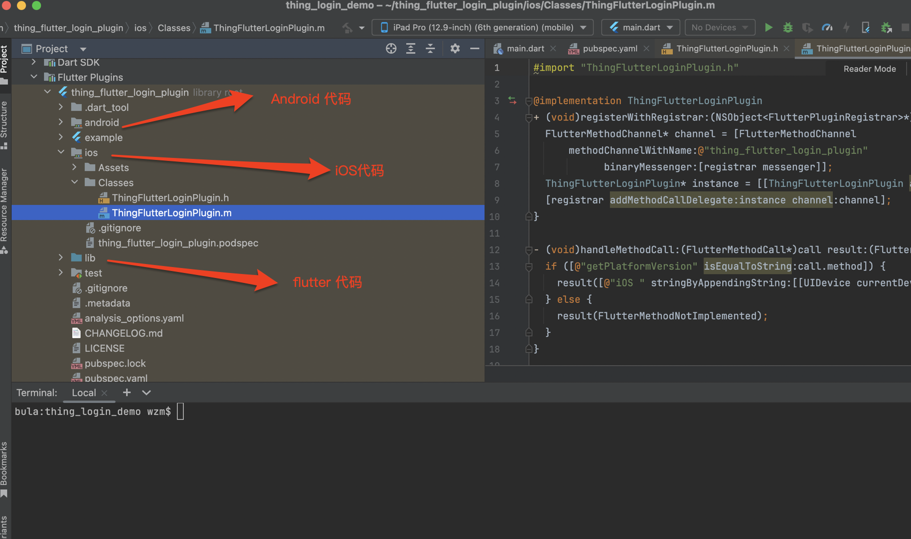
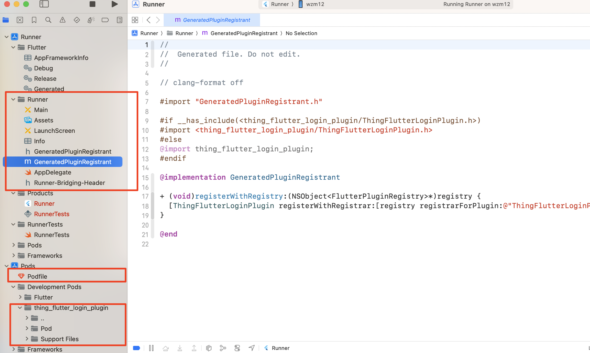
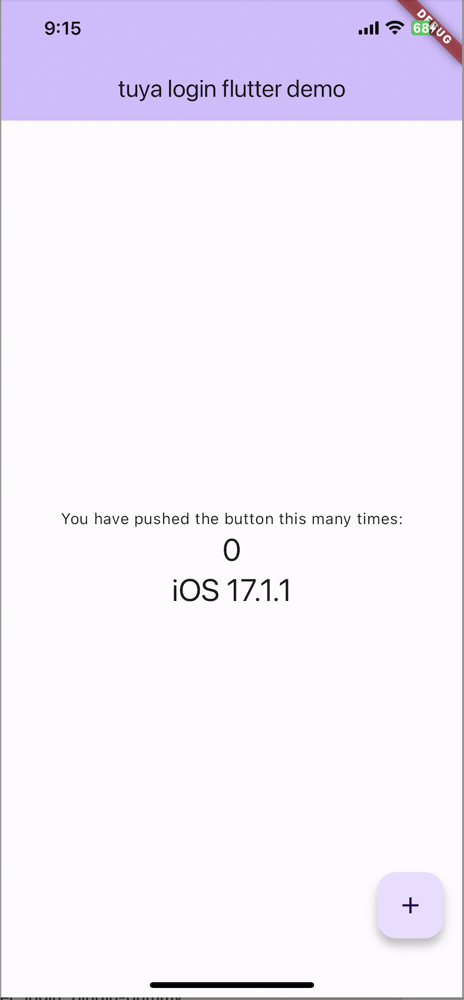
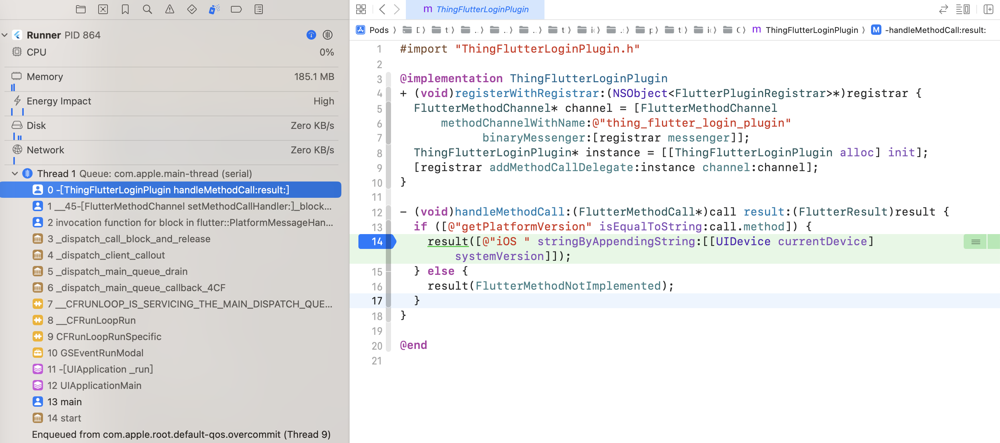

Flutter 开发简单介绍，老手请跳过，其他参考资料：
- flutter中文网：https://flutter.cn/docs
- flutter实战：https://book.flutterchina.club/chapter1/

# Flutter 安装
根据官方文档安装flutter，在终端里查看安装结果：
```
~ wzm$ flutter --version
Flutter 3.19.5 • channel stable • https://github.com/flutter/flutter.git
Framework • revision 300451adae (3 weeks ago) • 2024-03-27 21:54:07 -0500
Engine • revision e76c956498
Tools • Dart 3.3.3 • DevTools 2.31.1

```

# IDE 安装

VS or AS，无具体要求，这里记录下 AS 安装步骤

- 下载并安装 [Android studio](https://developer.android.com/studio?gad_source=1&gclid=CjwKCAjwoPOwBhAeEiwAJuXRhweO8zYkWbEkrzxtTPI5iCcNaVFUoL1l9jcTHKahUI9r-eiiUUs2ZRoCAZcQAvD_BwE&gclsrc=aw.ds&hl=zh-cn)

- 下载并安装 xcode、cocopods等
- 打开AS设置，选择插件，搜索并安装 flutter 、dart，完成后需重启AS

	

# Flutter Plugin

flutter plugin 允许 flutter代码 和 原生代码 相互调用
	
1. [如何开发Flutter插件](https://flutter.cn/docs/packages-and-plugins/developing-packages)
2. [如何使用Flutter插件](https://flutter.cn/docs/packages-and-plugins/using-packages)


- shell 创建插件 
	
	下面指令要求使用 ios 的 object-c 和 android 的 kotlin，可以根据需要指定语言, 详情通过 `flutter create -t plugin -h` 指令查看：
> flutter create --org com.tuya --template=plugin --platforms=android,ios -a kotlin -i objc thing_flutter_login_plugin

- 添加依赖

	如果插件以来其他Plugin、Package，需要添加以来，例如（demo不涉及组件发布介绍，所以全部采用本地依赖）：

	

- 更新依赖

	在 shell 里当前工程下执行 flutter pub get 执行更新依赖：

	

- 查看依赖

	安装后可以在工程package下看到我们添加的包

	

- 插件代码目录

	用过IDE打开flutter 插件工程后，可以看到一个默认的插件调用函数 getPlatformVersion ，他的能力就是提供一个Flutter 接口，从原生代码里获取设备版本，插件的原理是使用flutter框架的 MethodChannel 实现数据传递，详情这里不展开了

	

## Dart 代码

- thing_flutter_login_plugin_platform_interface.dart

	这个文件定义了插件接口协议（我们可以拆分不同的文件），可以看到定义了一个 接口 getPlatformVersion，他的默认实现是抛出一个异常。


```
import 'package:plugin_platform_interface/plugin_platform_interface.dart';

import 'thing_flutter_login_plugin_method_channel.dart';

abstract class ThingFlutterLoginPluginPlatform extends PlatformInterface {
  /// Constructs a ThingFlutterLoginPluginPlatform.
  ThingFlutterLoginPluginPlatform() : super(token: _token);

  static final Object _token = Object();

  static ThingFlutterLoginPluginPlatform _instance = MethodChannelThingFlutterLoginPlugin();

  /// The default instance of [ThingFlutterLoginPluginPlatform] to use.
  ///
  /// Defaults to [MethodChannelThingFlutterLoginPlugin].
  static ThingFlutterLoginPluginPlatform get instance => _instance;

  /// Platform-specific implementations should set this with their own
  /// platform-specific class that extends [ThingFlutterLoginPluginPlatform] when
  /// they register themselves.
  static set instance(ThingFlutterLoginPluginPlatform instance) {
    PlatformInterface.verifyToken(instance, _token);
    _instance = instance;
  }

  Future<String?> getPlatformVersion() {
    throw UnimplementedError('platformVersion() has not been implemented.');
  }
}
```

- thing_flutter_login_plugin_method_channel.dart

	这个文件是接口的实现，里面创建一个叫 `thing_flutter_login_plugin` 的 MethodChannel，并实现了getPlatformVersion 协议接口，即通过 MethodChannel 调用接口到原生。

```
import 'package:flutter/foundation.dart';
import 'package:flutter/services.dart';

import 'thing_flutter_login_plugin_platform_interface.dart';

/// An implementation of [ThingFlutterLoginPluginPlatform] that uses method channels.
class MethodChannelThingFlutterLoginPlugin extends ThingFlutterLoginPluginPlatform {
  /// The method channel used to interact with the native platform.
  @visibleForTesting
  final methodChannel = const MethodChannel('thing_flutter_login_plugin');

  @override
  Future<String?> getPlatformVersion() async {
    final version = await methodChannel.invokeMethod<String>('getPlatformVersion');
    return version;
  }
}
```

- thing_flutter_login_plugin.dart 

	这里是对协议调用的一个封装


```
import 'thing_flutter_login_plugin_platform_interface.dart';

class ThingFlutterLoginPlugin {
  Future<String?> getPlatformVersion() {
    return ThingFlutterLoginPluginPlatform.instance.getPlatformVersion();
  }
}
```

## iOS 代码

- ThingFlutterLoginPlugin.m

	对应dart 代码，这里通过 FlutterMethodChannel 去获取我们上面创建的名为 `thing_flutter_login_plugin` 的 FlutterMethodChannel，并监听他的调用事件。


```

#import "ThingFlutterLoginPlugin.h"

@implementation ThingFlutterLoginPlugin
+ (void)registerWithRegistrar:(NSObject<FlutterPluginRegistrar>*)registrar {
  FlutterMethodChannel* channel = [FlutterMethodChannel
      methodChannelWithName:@"thing_flutter_login_plugin"
            binaryMessenger:[registrar messenger]];
  ThingFlutterLoginPlugin* instance = [[ThingFlutterLoginPlugin alloc] init];
  [registrar addMethodCallDelegate:instance channel:channel];
}

- (void)handleMethodCall:(FlutterMethodCall*)call result:(FlutterResult)result {
  if ([@"getPlatformVersion" isEqualToString:call.method]) {
    result([@"iOS " stringByAppendingString:[[UIDevice currentDevice] systemVersion]]);
  } else {
    result(FlutterMethodNotImplemented);
  }
}

@end
```

插件在集成启动运行后，会发现插件代码会拷贝到原生工程目录下：


## Android 代码：

略
 
## 运行调试



而且如果在原生代码里断点，也能看到调用：

